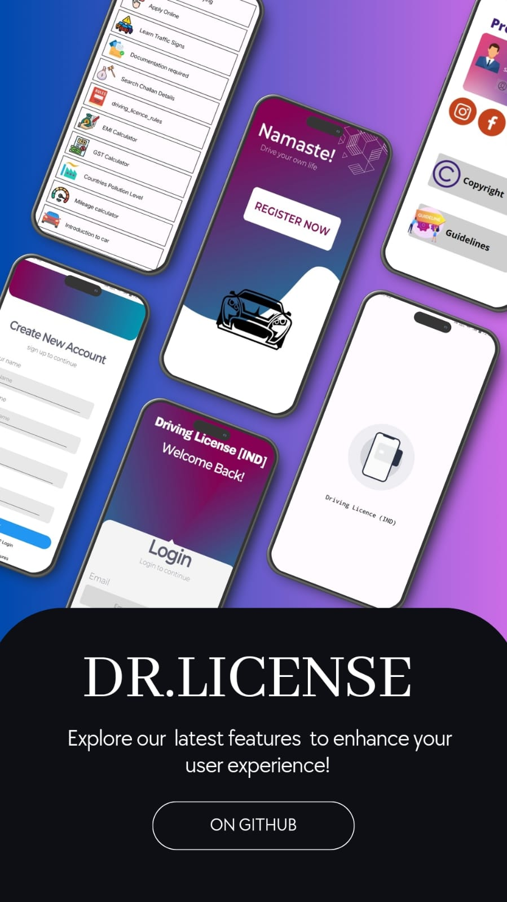

# Driving_licenses-IND

Step-by-step guide for your driving license application. This Android application helps users register, manage their profiles, apply for driving licenses, and provides various useful features related to driving and vehicle management.

## Table of Contents

- [Overview](#overview)
- [Features](#features)
- [Screenshots](#screenshots)
- [Installation](#installation)
- [Usage](#usage)
- [Contributing](#contributing)
- [License](#license)

## Overview

This project aims to simplify the process of applying for a driving license and provide users with essential tools and information related to driving and vehicle management. Developed for Android, it includes features such as user registration, profile management, driving license application, and more.

## Features

- **User Registration**: Implement a user registration system where users can create accounts using their email or phone number.
- **Profile Management**: Allow users to manage their profiles, including personal details and a profile picture.
- **Driving License Application**: Create a section for users to apply for a driving license. Collect necessary information and guide users through the application process.
- **Learning Module**: Include a section for learning about traffic rules, road signs, and safe driving practices. Incorporate informative content and quizzes to assess users' knowledge.
- **Speed Test**: Integrate a feature for users to test their driving speed. Implement a speedometer and provide feedback or tips based on their driving speed.
- **Weather Information**: Integrate a weather API to provide users with real-time weather updates. Users can check weather conditions before planning their journeys.
- **Mileage Calculator**: Develop a mileage calculator to help users estimate fuel consumption and costs based on their vehicle type and distance traveled.
- **EMI Calculator**: Include an EMI (Equated Monthly Installment) calculator for users to estimate loan repayments related to vehicle purchases.
- **Air Pollution Level**: Integrate an API that provides air quality index (AQI) information. Users can check the air pollution level of their current location or select a specific area.

## Screenshots

### Welcome Page


## Installation

1. Clone the repository:
    ```sh
    git clone https://github.com/100rabx23/Driving_licenses-IND.git
    ```

2. Open the project in Android Studio.

3. Build the project to restore dependencies and compile the application.

## Usage

1. Run the application from Android Studio on an emulator or physical device.
2. Use the GUI to interact with the system:
    - Register a new account
    - Log in to your account
    - Manage your profile
    - Apply for a driving license
    - Use the learning module, speed test, weather information, mileage calculator, EMI calculator, and air pollution level features

## Contributing

Contributions are welcome! Please fork the repository and create a pull request with your changes.

1. Fork the repository
2. Create your feature branch (`git checkout -b feature/YourFeature`)
3. Commit your changes (`git commit -m 'Add some feature'`)
4. Push to the branch (`git push origin feature/YourFeature`)
5. Open a pull request

## License

This project is licensed under the MIT License. See the [LICENSE](LICENSE) file for details.
